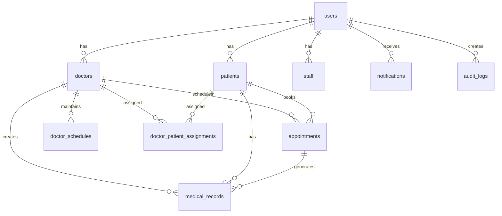
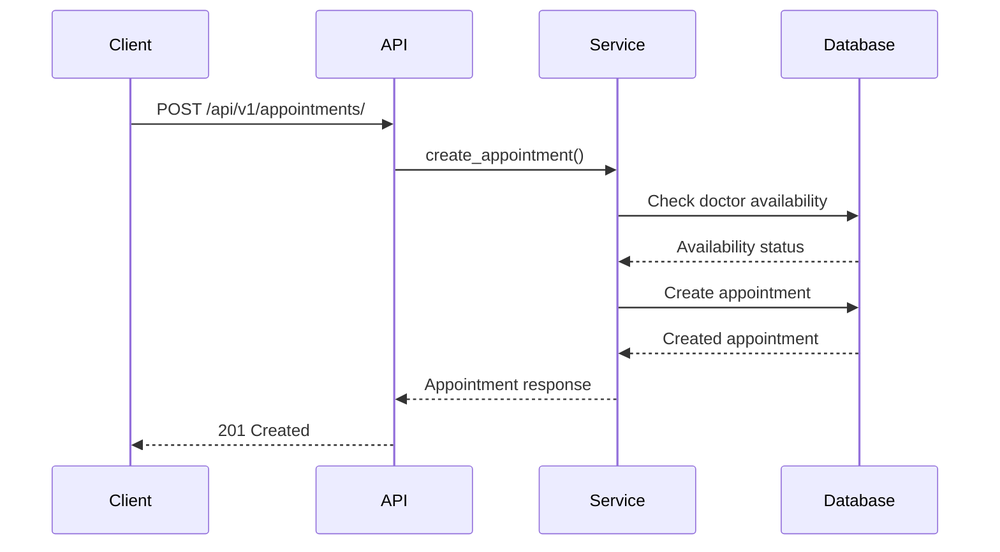
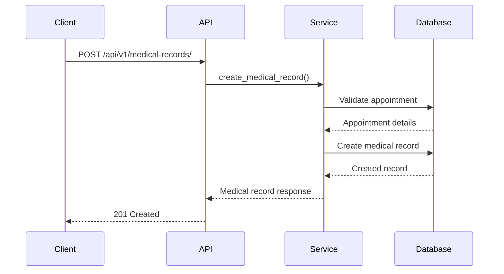
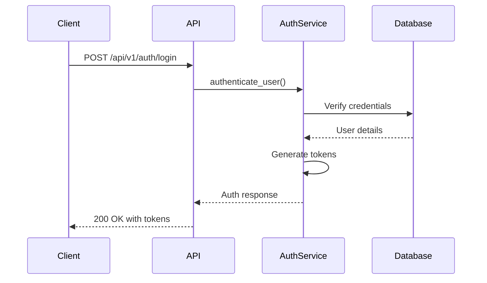
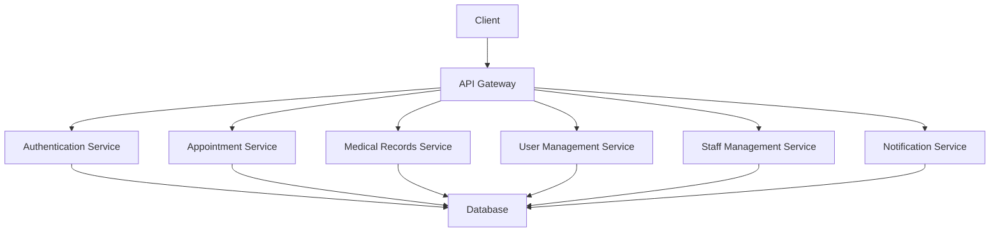

# Final Documentation

## Table of Contents
1. [Design Decisions](#design-decisions)
2. [API Documentation](#api-documentation)
3. [Database Schema](#database-schema)
4. [Sequence Diagrams](#sequence-diagrams)
5. [Architecture](#architecture)
6. [Deployment Guide](#deployment-guide)

## Design Decisions

### 1. Technology Stack Selection

#### Backend Framework: FastAPI
- **Decision**: Chose FastAPI over Django/Flask
- **Rationale**:
  - Modern async support
  - Automatic API documentation
  - Type hints and validation
  - High performance
  - Easy integration with SQLAlchemy

#### Database: PostgreSQL
- **Decision**: Selected PostgreSQL over other RDBMS
- **Rationale**:
  - Robust JSON support
  - Advanced indexing capabilities
  - Strong data integrity
  - Excellent concurrency handling
  - UUID support

#### ORM: SQLAlchemy
- **Decision**: Used SQLAlchemy for database operations
- **Rationale**:
  - Powerful query building
  - Flexible relationship handling
  - Excellent PostgreSQL support
  - Mature and stable
  - Strong community support

### 2. Architecture Decisions

#### Microservices vs Monolithic
- **Decision**: Started with monolithic architecture
- **Rationale**:
  - Simpler initial development
  - Easier deployment
  - Reduced complexity
  - Future microservice migration path

#### Authentication System
- **Decision**: JWT-based authentication
- **Rationale**:
  - Stateless authentication
  - Scalable
  - Easy to implement
  - Secure token handling

### 3. Data Model Decisions

#### UUID vs Auto-increment
- **Decision**: Used UUID for primary keys
- **Rationale**:
  - Globally unique identifiers
  - No sequential exposure
  - Better for distributed systems
  - Easier data merging

#### Soft Delete vs Hard Delete
- **Decision**: Implemented soft delete
- **Rationale**:
  - Data recovery capability
  - Audit trail maintenance
  - Historical data preservation
  - Compliance requirements

## API Documentation

### Authentication Module

#### Login
```http
POST /api/v1/auth/login
Content-Type: application/json

{
    "username": "string",
    "password": "string"
}
```

Response:
```json
{
    "access_token": "string",
    "token_type": "bearer",
    "user": {
        "id": "uuid",
        "username": "string",
        "email": "string",
        "role": "string"
    }
}
```

#### Register
```http
POST /api/v1/auth/register
Content-Type: application/json

{
    "username": "string",
    "email": "string",
    "password": "string",
    "full_name": "string",
    "role": "string"
}
```

#### Refresh Token
```http
POST /api/v1/auth/refresh
Authorization: Bearer {refresh_token}
```

#### Change Password
```http
PUT /api/v1/auth/change-password
Authorization: Bearer {access_token}
Content-Type: application/json

{
    "current_password": "string",
    "new_password": "string"
}
```

### User Management Module

#### Get User Profile
```http
GET /api/v1/users/profile
Authorization: Bearer {access_token}
```

#### Update User Profile
```http
PUT /api/v1/users/profile
Authorization: Bearer {access_token}
Content-Type: application/json

{
    "full_name": "string",
    "email": "string",
    "phone": "string"
}
```

#### List Users (Admin Only)
```http
GET /api/v1/users/
Authorization: Bearer {access_token}
Query Parameters:
  - page: int
  - size: int
  - role: string
  - is_active: boolean
```

#### Update User Status (Admin Only)
```http
PUT /api/v1/users/{user_id}/status
Authorization: Bearer {access_token}
Content-Type: application/json

{
    "is_active": boolean
}
```

### Appointment Module

#### Create Appointment
```http
POST /api/v1/appointments/
Authorization: Bearer {access_token}
Content-Type: application/json

{
    "doctor_id": "uuid",
    "patient_id": "uuid",
    "start_time": "datetime",
    "end_time": "datetime",
    "reason": "string",
    "notes": "string",
    "is_recurring": boolean,
    "recurrence_pattern": "string",
    "recurrence_end_date": "date"
}
```

#### Get Appointment
```http
GET /api/v1/appointments/{appointment_id}
Authorization: Bearer {access_token}
```

#### Update Appointment
```http
PUT /api/v1/appointments/{appointment_id}
Authorization: Bearer {access_token}
Content-Type: application/json

{
    "status": "string",
    "notes": "string",
    "start_time": "datetime",
    "end_time": "datetime"
}
```

#### Delete Appointment
```http
DELETE /api/v1/appointments/{appointment_id}
Authorization: Bearer {access_token}
```

#### List Appointments
```http
GET /api/v1/appointments/
Authorization: Bearer {access_token}
Query Parameters:
  - doctor_id: uuid
  - patient_id: uuid
  - status: string
  - start_date: date
  - end_date: date
  - page: int
  - size: int
```

#### Get Doctor Availability
```http
GET /api/v1/appointments/availability/{doctor_id}
Authorization: Bearer {access_token}
Query Parameters:
  - date: date
  - duration: int (minutes)
```

### Medical Records Module

#### Create Medical Record
```http
POST /api/v1/medical-records/
Authorization: Bearer {access_token}
Content-Type: application/json

{
    "patient_id": "uuid",
    "doctor_id": "uuid",
    "appointment_id": "uuid",
    "diagnosis": "string",
    "prescription": "string",
    "notes": "string"
}
```

#### Get Medical Record
```http
GET /api/v1/medical-records/{record_id}
Authorization: Bearer {access_token}
```

#### Update Medical Record
```http
PUT /api/v1/medical-records/{record_id}
Authorization: Bearer {access_token}
Content-Type: application/json

{
    "diagnosis": "string",
    "prescription": "string",
    "notes": "string"
}
```

#### List Medical Records
```http
GET /api/v1/medical-records/
Authorization: Bearer {access_token}
Query Parameters:
  - patient_id: uuid
  - doctor_id: uuid
  - start_date: date
  - end_date: date
  - page: int
  - size: int
```

### Doctor-Patient Assignment Module

#### Create Assignment
```http
POST /api/v1/doctor-patient-assignments/
Authorization: Bearer {access_token}
Content-Type: application/json

{
    "doctor_id": "uuid",
    "patient_id": "uuid",
    "notes": "string"
}
```

#### Get Assignment
```http
GET /api/v1/doctor-patient-assignments/{assignment_id}
Authorization: Bearer {access_token}
```

#### Update Assignment
```http
PUT /api/v1/doctor-patient-assignments/{assignment_id}
Authorization: Bearer {access_token}
Content-Type: application/json

{
    "is_active": boolean,
    "notes": "string"
}
```

#### List Assignments
```http
GET /api/v1/doctor-patient-assignments/
Authorization: Bearer {access_token}
Query Parameters:
  - doctor_id: uuid
  - patient_id: uuid
  - is_active: boolean
  - page: int
  - size: int
```

### Doctor Schedule Module

#### Create Schedule
```http
POST /api/v1/doctor-schedules/
Authorization: Bearer {access_token}
Content-Type: application/json

{
    "doctor_id": "uuid",
    "day_of_week": int,
    "start_time": "time",
    "end_time": "time",
    "is_available": boolean
}
```

#### Get Schedule
```http
GET /api/v1/doctor-schedules/{schedule_id}
Authorization: Bearer {access_token}
```

#### Update Schedule
```http
PUT /api/v1/doctor-schedules/{schedule_id}
Authorization: Bearer {access_token}
Content-Type: application/json

{
    "start_time": "time",
    "end_time": "time",
    "is_available": boolean
}
```

#### List Schedules
```http
GET /api/v1/doctor-schedules/
Authorization: Bearer {access_token}
Query Parameters:
  - doctor_id: uuid
  - day_of_week: int
  - is_available: boolean
  - page: int
  - size: int
```

### Staff Management Module

#### Create Staff
```http
POST /api/v1/staff/
Authorization: Bearer {access_token}
Content-Type: application/json

{
    "user_id": "uuid",
    "department": "string",
    "position": "string",
    "status": "string"
}
```

#### Get Staff
```http
GET /api/v1/staff/{staff_id}
Authorization: Bearer {access_token}
```

#### Update Staff
```http
PUT /api/v1/staff/{staff_id}
Authorization: Bearer {access_token}
Content-Type: application/json

{
    "department": "string",
    "position": "string",
    "status": "string"
}
```

#### List Staff
```http
GET /api/v1/staff/
Authorization: Bearer {access_token}
Query Parameters:
  - department: string
  - position: string
  - status: string
  - page: int
  - size: int
```

### Notification Module

#### Get Notifications
```http
GET /api/v1/notifications/
Authorization: Bearer {access_token}
Query Parameters:
  - is_read: boolean
  - type: string
  - page: int
  - size: int
```

#### Mark Notification as Read
```http
PUT /api/v1/notifications/{notification_id}/read
Authorization: Bearer {access_token}
```

#### Mark All Notifications as Read
```http
PUT /api/v1/notifications/read-all
Authorization: Bearer {access_token}
```

### Audit Log Module

#### Get Audit Logs
```http
GET /api/v1/audit-logs/
Authorization: Bearer {access_token}
Query Parameters:
  - user_id: uuid
  - action: string
  - resource_type: string
  - start_date: datetime
  - end_date: datetime
  - page: int
  - size: int
```

## Database Schema

### Entity Relationship Diagram



### Complete Database Schema

#### Users Table
```sql
CREATE TABLE users (
    id UUID PRIMARY KEY DEFAULT uuid_generate_v4(),
    username VARCHAR(100) UNIQUE NOT NULL,
    email VARCHAR(255) UNIQUE NOT NULL,
    full_name VARCHAR(255) NOT NULL,
    password_hash VARCHAR(255) NOT NULL,
    role VARCHAR(20) NOT NULL CHECK (role IN ('admin', 'doctor', 'staff', 'patient')),
    patient_id UUID REFERENCES patients(id) ON DELETE SET NULL,
    doctor_id UUID REFERENCES doctors(id) ON DELETE SET NULL,
    is_active BOOLEAN DEFAULT TRUE,
    last_login TIMESTAMP WITH TIME ZONE,
    created_at TIMESTAMP WITH TIME ZONE DEFAULT NOW(),
    updated_at TIMESTAMP WITH TIME ZONE DEFAULT NOW(),
    CONSTRAINT user_role_link CHECK (
        (role = 'patient' AND patient_id IS NOT NULL AND doctor_id IS NULL) OR
        (role = 'doctor' AND doctor_id IS NOT NULL AND patient_id IS NULL) OR
        (role IN ('admin', 'staff') AND patient_id IS NULL AND doctor_id IS NULL)
    )
);
```

#### Patients Table
```sql
CREATE TABLE patients (
    id UUID PRIMARY KEY DEFAULT uuid_generate_v4(),
    first_name VARCHAR(255) NOT NULL,
    last_name VARCHAR(255) NOT NULL,
    date_of_birth DATE NOT NULL,
    email VARCHAR(255) UNIQUE NOT NULL,
    phone VARCHAR(20) NOT NULL,
    address TEXT NOT NULL,
    insurance_info JSONB,
    created_at TIMESTAMP WITH TIME ZONE DEFAULT NOW(),
    updated_at TIMESTAMP WITH TIME ZONE DEFAULT NOW()
);
```

#### Doctors Table
```sql
CREATE TABLE doctors (
    id UUID PRIMARY KEY DEFAULT uuid_generate_v4(),
    first_name VARCHAR(255) NOT NULL,
    last_name VARCHAR(255) NOT NULL,
    specialization VARCHAR(255) NOT NULL,
    email VARCHAR(255) UNIQUE NOT NULL,
    phone VARCHAR(20) NOT NULL,
    license_number VARCHAR(100) UNIQUE NOT NULL,
    is_active BOOLEAN DEFAULT TRUE,
    created_at TIMESTAMP WITH TIME ZONE DEFAULT NOW(),
    updated_at TIMESTAMP WITH TIME ZONE DEFAULT NOW()
);
```

#### Staff Table
```sql
CREATE TABLE staff (
    id UUID PRIMARY KEY DEFAULT uuid_generate_v4(),
    user_id UUID NOT NULL UNIQUE REFERENCES users(id) ON DELETE CASCADE,
    department VARCHAR(100) NOT NULL,
    position VARCHAR(100) NOT NULL,
    status VARCHAR(20) NOT NULL DEFAULT 'unverified',
    hire_date TIMESTAMP WITH TIME ZONE NOT NULL DEFAULT CURRENT_TIMESTAMP,
    created_at TIMESTAMP WITH TIME ZONE NOT NULL DEFAULT CURRENT_TIMESTAMP,
    updated_at TIMESTAMP WITH TIME ZONE NOT NULL DEFAULT CURRENT_TIMESTAMP
);
```

#### Appointments Table
```sql
CREATE TABLE appointments (
    id UUID PRIMARY KEY DEFAULT uuid_generate_v4(),
    doctor_id UUID NOT NULL REFERENCES doctors(id) ON DELETE CASCADE,
    patient_id UUID NOT NULL REFERENCES patients(id) ON DELETE CASCADE,
    start_time TIMESTAMP WITH TIME ZONE NOT NULL,
    end_time TIMESTAMP WITH TIME ZONE NOT NULL,
    status VARCHAR(20) NOT NULL DEFAULT 'scheduled',
    reason TEXT NOT NULL,
    notes TEXT,
    is_recurring BOOLEAN DEFAULT FALSE,
    recurrence_pattern VARCHAR(20),
    recurrence_end_date TIMESTAMP WITH TIME ZONE,
    created_at TIMESTAMP WITH TIME ZONE DEFAULT NOW(),
    updated_at TIMESTAMP WITH TIME ZONE DEFAULT NOW(),
    CONSTRAINT check_end_time_after_start_time CHECK (end_time > start_time),
    CONSTRAINT check_valid_status CHECK (status IN ('scheduled', 'confirmed', 'completed', 'cancelled'))
);
```

#### Medical Records Table
```sql
CREATE TABLE medical_records (
    id UUID PRIMARY KEY DEFAULT uuid_generate_v4(),
    patient_id UUID NOT NULL REFERENCES patients(id) ON DELETE CASCADE,
    appointment_id UUID REFERENCES appointments(id) ON DELETE SET NULL,
    doctor_id UUID NOT NULL REFERENCES doctors(id) ON DELETE CASCADE,
    diagnosis TEXT,
    prescription TEXT,
    notes TEXT,
    created_at TIMESTAMP WITH TIME ZONE DEFAULT NOW(),
    updated_at TIMESTAMP WITH TIME ZONE DEFAULT NOW()
);
```

#### Doctor Schedules Table
```sql
CREATE TABLE doctor_schedules (
    id UUID PRIMARY KEY DEFAULT uuid_generate_v4(),
    doctor_id UUID NOT NULL REFERENCES doctors(id) ON DELETE CASCADE,
    day_of_week INT NOT NULL,
    start_time TIME NOT NULL,
    end_time TIME NOT NULL,
    is_available BOOLEAN DEFAULT TRUE,
    CONSTRAINT valid_day_of_week CHECK (day_of_week BETWEEN 0 AND 6),
    CONSTRAINT valid_time_range CHECK (start_time < end_time),
    UNIQUE (doctor_id, day_of_week)
);
```

#### Doctor Patient Assignments Table
```sql
CREATE TABLE doctor_patient_assignments (
    id UUID PRIMARY KEY DEFAULT uuid_generate_v4(),
    doctor_id UUID NOT NULL REFERENCES doctors(id) ON DELETE CASCADE,
    patient_id UUID NOT NULL REFERENCES patients(id) ON DELETE CASCADE,
    assigned_date TIMESTAMP WITH TIME ZONE DEFAULT NOW(),
    is_active BOOLEAN DEFAULT TRUE,
    notes TEXT,
    created_at TIMESTAMP WITH TIME ZONE DEFAULT NOW(),
    updated_at TIMESTAMP WITH TIME ZONE DEFAULT NOW(),
    UNIQUE (doctor_id, patient_id)
);
```

#### Notifications Table
```sql
CREATE TABLE notifications (
    id UUID PRIMARY KEY DEFAULT uuid_generate_v4(),
    user_id UUID NOT NULL REFERENCES users(id) ON DELETE CASCADE,
    type VARCHAR(50) NOT NULL,
    content TEXT NOT NULL,
    is_read BOOLEAN DEFAULT FALSE,
    created_at TIMESTAMP WITH TIME ZONE DEFAULT NOW()
);
```

#### Audit Logs Table
```sql
CREATE TABLE audit_logs (
    id UUID PRIMARY KEY DEFAULT uuid_generate_v4(),
    user_id UUID REFERENCES users(id) ON DELETE SET NULL,
    action VARCHAR(50) NOT NULL,
    resource_type VARCHAR(50) NOT NULL,
    resource_id UUID,
    details JSONB,
    ip_address VARCHAR(45),
    created_at TIMESTAMP WITH TIME ZONE DEFAULT NOW()
);
```

### Indexes

```sql
-- Users table indexes
CREATE INDEX idx_users_email ON users(email);
CREATE INDEX idx_users_role ON users(role);
CREATE INDEX idx_users_is_active ON users(is_active);

-- Patients table indexes
CREATE INDEX idx_patients_email ON patients(email);
CREATE INDEX idx_patients_name ON patients(first_name, last_name);

-- Doctors table indexes
CREATE INDEX idx_doctors_email ON doctors(email);
CREATE INDEX idx_doctors_specialization ON doctors(specialization);
CREATE INDEX idx_doctors_is_active ON doctors(is_active);

-- Appointments table indexes
CREATE INDEX idx_appointments_doctor_id ON appointments(doctor_id);
CREATE INDEX idx_appointments_patient_id ON appointments(patient_id);
CREATE INDEX idx_appointments_start_time ON appointments(start_time);
CREATE INDEX idx_appointments_status ON appointments(status);

-- Medical Records table indexes
CREATE INDEX idx_medical_records_patient_id ON medical_records(patient_id);
CREATE INDEX idx_medical_records_doctor_id ON medical_records(doctor_id);
CREATE INDEX idx_medical_records_appointment_id ON medical_records(appointment_id);

-- Doctor Schedules table indexes
CREATE INDEX idx_doctor_schedules_doctor_id ON doctor_schedules(doctor_id);
CREATE INDEX idx_doctor_schedules_day ON doctor_schedules(day_of_week);
CREATE INDEX idx_doctor_schedules_availability ON doctor_schedules(is_available);

-- Doctor Patient Assignments table indexes
CREATE INDEX idx_doctor_patient_assignments_doctor_id ON doctor_patient_assignments(doctor_id);
CREATE INDEX idx_doctor_patient_assignments_patient_id ON doctor_patient_assignments(patient_id);
CREATE INDEX idx_doctor_patient_assignments_is_active ON doctor_patient_assignments(is_active);

-- Notifications table indexes
CREATE INDEX idx_notifications_user_id ON notifications(user_id);
CREATE INDEX idx_notifications_is_read ON notifications(is_read);
CREATE INDEX idx_notifications_type ON notifications(type);

-- Audit Logs table indexes
CREATE INDEX idx_audit_logs_user_id ON audit_logs(user_id);
CREATE INDEX idx_audit_logs_action ON audit_logs(action);
CREATE INDEX idx_audit_logs_resource_type ON audit_logs(resource_type);
CREATE INDEX idx_audit_logs_created_at ON audit_logs(created_at);
```

### Views

```sql
-- Upcoming Appointments View
CREATE VIEW upcoming_appointments AS
SELECT 
    a.id,
    a.start_time,
    a.end_time,
    a.status,
    p.id AS patient_id,
    p.first_name AS patient_first_name,
    p.last_name AS patient_last_name,
    d.id AS doctor_id,
    d.first_name AS doctor_first_name,
    d.last_name AS doctor_last_name,
    d.specialization
FROM 
    appointments a
JOIN 
    patients p ON a.patient_id = p.id
JOIN 
    doctors d ON a.doctor_id = d.id
WHERE 
    a.status IN ('scheduled', 'confirmed')
    AND a.start_time > NOW()
ORDER BY 
    a.start_time ASC;

-- Doctor Availability View
CREATE VIEW doctor_availability AS
SELECT 
    d.id AS doctor_id,
    d.first_name,
    d.last_name,
    ds.day_of_week,
    ds.start_time,
    ds.end_time,
    ds.is_available
FROM 
    doctors d
JOIN 
    doctor_schedules ds ON d.id = ds.doctor_id
WHERE 
    ds.is_available = TRUE
ORDER BY 
    d.id, ds.day_of_week;
```

### Triggers

```sql
-- Prevent appointment overlap
CREATE OR REPLACE FUNCTION check_appointment_overlap()
RETURNS TRIGGER AS $$
BEGIN
    IF EXISTS (
        SELECT 1 FROM appointments
        WHERE 
            doctor_id = NEW.doctor_id
            AND id != NEW.id
            AND status != 'cancelled'
            AND (
                (NEW.start_time < end_time AND NEW.end_time > start_time)
            )
    ) THEN
        RAISE EXCEPTION 'Appointment overlaps with existing appointment for this doctor';
    END IF;
    RETURN NEW;
END;
$$ LANGUAGE plpgsql;

CREATE TRIGGER prevent_appointment_overlap
BEFORE INSERT OR UPDATE ON appointments
FOR EACH ROW
EXECUTE FUNCTION check_appointment_overlap();

-- Update modified timestamp
CREATE OR REPLACE FUNCTION update_modified_column()
RETURNS TRIGGER AS $$
BEGIN
    NEW.updated_at = NOW();
    RETURN NEW;
END;
$$ LANGUAGE plpgsql;

-- Create triggers for all tables with updated_at
CREATE TRIGGER update_users_modtime
BEFORE UPDATE ON users
FOR EACH ROW
EXECUTE FUNCTION update_modified_column();

CREATE TRIGGER update_patients_modtime
BEFORE UPDATE ON patients
FOR EACH ROW
EXECUTE FUNCTION update_modified_column();

CREATE TRIGGER update_doctors_modtime
BEFORE UPDATE ON doctors
FOR EACH ROW
EXECUTE FUNCTION update_modified_column();

CREATE TRIGGER update_staff_modtime
BEFORE UPDATE ON staff
FOR EACH ROW
EXECUTE FUNCTION update_modified_column();

CREATE TRIGGER update_appointments_modtime
BEFORE UPDATE ON appointments
FOR EACH ROW
EXECUTE FUNCTION update_modified_column();

CREATE TRIGGER update_medical_records_modtime
BEFORE UPDATE ON medical_records
FOR EACH ROW
EXECUTE FUNCTION update_modified_column();

CREATE TRIGGER update_doctor_schedules_modtime
BEFORE UPDATE ON doctor_schedules
FOR EACH ROW
EXECUTE FUNCTION update_modified_column();

CREATE TRIGGER update_doctor_patient_assignments_modtime
BEFORE UPDATE ON doctor_patient_assignments
FOR EACH ROW
EXECUTE FUNCTION update_modified_column();
```

## Sequence Diagrams

### Appointment Creation Flow



### Medical Record Creation Flow



### Authentication Flow



## Architecture

### System Architecture



### Component Architecture

1. **API Layer**
   - FastAPI application
   - Route handlers
   - Request validation
   - Response formatting
   - Error handling
   - Rate limiting
   - CORS management

2. **Service Layer**
   - Business logic
   - Data validation
   - Transaction management
   - Error handling
   - Cache management
   - Background tasks

3. **Data Layer**
   - SQLAlchemy models
   - Database operations
   - Query optimization
   - Data integrity
   - Connection pooling
   - Transaction management

4. **Security Layer**
   - Authentication
   - Authorization
   - Input validation
   - Data encryption
   - Audit logging
   - Rate limiting

5. **Integration Layer**
   - External service integration
   - Message queue handling
   - Webhook management
   - API versioning
   - Documentation generation

## Deployment Guide

### Prerequisites

1. **Server Requirements**
   - Ubuntu 20.04 LTS or later
   - 4GB RAM minimum
   - 2 CPU cores minimum
   - 20GB storage minimum

2. **Software Requirements**
   - Python 3.11+
   - PostgreSQL 14+
   - Nginx
   - Docker (optional)
   - Docker Compose (optional)
   - Redis (for caching)
   - Celery (for background tasks)

### Deployment Steps

1. **Server Setup**
```bash
# Update system
sudo apt update && sudo apt upgrade -y

# Install required packages
sudo apt install -y python3.11 python3.11-venv nginx postgresql redis-server
```

2. **Database Setup**
```bash
# Create database user
sudo -u postgres createuser -P appointment_scheduler

# Create database
sudo -u postgres createdb -O appointment_scheduler appointment_scheduler_db

# Enable UUID extension
sudo -u postgres psql -d appointment_scheduler_db -c "CREATE EXTENSION IF NOT EXISTS \"uuid-ossp\";"
```

3. **Application Setup**
```bash
# Clone repository
git clone https://github.com/yourusername/AppointmentScheduler.git
cd AppointmentScheduler

# Create virtual environment
python3.11 -m venv venv
source venv/bin/activate

# Install dependencies
pip install -r requirements.txt

# Set up environment variables
cp .env.example .env
# Edit .env with production settings
```

4. **Nginx Configuration**
```nginx
server {
    listen 80;
    server_name yourdomain.com;

    location / {
        proxy_pass http://localhost:8000;
        proxy_set_header Host $host;
        proxy_set_header X-Real-IP $remote_addr;
        proxy_set_header X-Forwarded-For $proxy_add_x_forwarded_for;
        proxy_set_header X-Forwarded-Proto $scheme;
    }

    location /static/ {
        alias /path/to/AppointmentScheduler/static/;
    }

    location /media/ {
        alias /path/to/AppointmentScheduler/media/;
    }
}
```

5. **Systemd Services**

Application Service:
```ini
[Unit]
Description=Appointment Scheduler API
After=network.target postgresql.service redis-server.service

[Service]
User=ubuntu
Group=ubuntu
WorkingDirectory=/path/to/AppointmentScheduler
Environment="PATH=/path/to/AppointmentScheduler/venv/bin"
Environment="PYTHONPATH=/path/to/AppointmentScheduler"
ExecStart=/path/to/AppointmentScheduler/venv/bin/uvicorn app.main:app --host 0.0.0.0 --port 8000 --workers 4
Restart=always

[Install]
WantedBy=multi-user.target
```

Celery Worker Service:
```ini
[Unit]
Description=Appointment Scheduler Celery Worker
After=network.target postgresql.service redis-server.service

[Service]
User=ubuntu
Group=ubuntu
WorkingDirectory=/path/to/AppointmentScheduler
Environment="PATH=/path/to/AppointmentScheduler/venv/bin"
Environment="PYTHONPATH=/path/to/AppointmentScheduler"
ExecStart=/path/to/AppointmentScheduler/venv/bin/celery -A app.worker worker --loglevel=info
Restart=always

[Install]
WantedBy=multi-user.target
```

Celery Beat Service:
```ini
[Unit]
Description=Appointment Scheduler Celery Beat
After=network.target postgresql.service redis-server.service

[Service]
User=ubuntu
Group=ubuntu
WorkingDirectory=/path/to/AppointmentScheduler
Environment="PATH=/path/to/AppointmentScheduler/venv/bin"
Environment="PYTHONPATH=/path/to/AppointmentScheduler"
ExecStart=/path/to/AppointmentScheduler/venv/bin/celery -A app.worker beat --loglevel=info
Restart=always

[Install]
WantedBy=multi-user.target
```

6. **SSL Setup**
```bash
# Install Certbot
sudo apt install -y certbot python3-certbot-nginx

# Obtain SSL certificate
sudo certbot --nginx -d yourdomain.com
```

### Monitoring and Maintenance

1. **Logging**
   - Application logs: `/var/log/appointment-scheduler/app.log`
   - Access logs: `/var/log/nginx/access.log`
   - Error logs: `/var/log/nginx/error.log`
   - Celery logs: `/var/log/celery/worker.log`
   - Database logs: `/var/log/postgresql/postgresql-14-main.log`

2. **Backup Strategy**
```bash
# Database backup
pg_dump -U appointment_scheduler appointment_scheduler_db | gzip > /backups/appointment_scheduler_$(date +\%Y\%m\%d).sql.gz

# Automated backup script
0 0 * * * pg_dump -U appointment_scheduler appointment_scheduler_db | gzip > /backups/appointment_scheduler_$(date +\%Y\%m\%d).sql.gz
```

3. **Monitoring**
   - System metrics: Prometheus + Grafana
   - Application metrics: FastAPI metrics endpoint
   - Log aggregation: ELK Stack
   - Database monitoring: pgAdmin
   - Cache monitoring: Redis Commander

### Scaling Considerations

1. **Vertical Scaling**
   - Increase server resources
   - Optimize database configuration
   - Implement caching
   - Tune application parameters

2. **Horizontal Scaling**
   - Load balancing with Nginx
   - Database replication
   - Session management
   - Cache distribution
   - Worker distribution

3. **Performance Optimization**
   - Database indexing
   - Query optimization
   - Caching strategies
   - Connection pooling
   - Background task processing
   - Static file serving
   - API response compression 